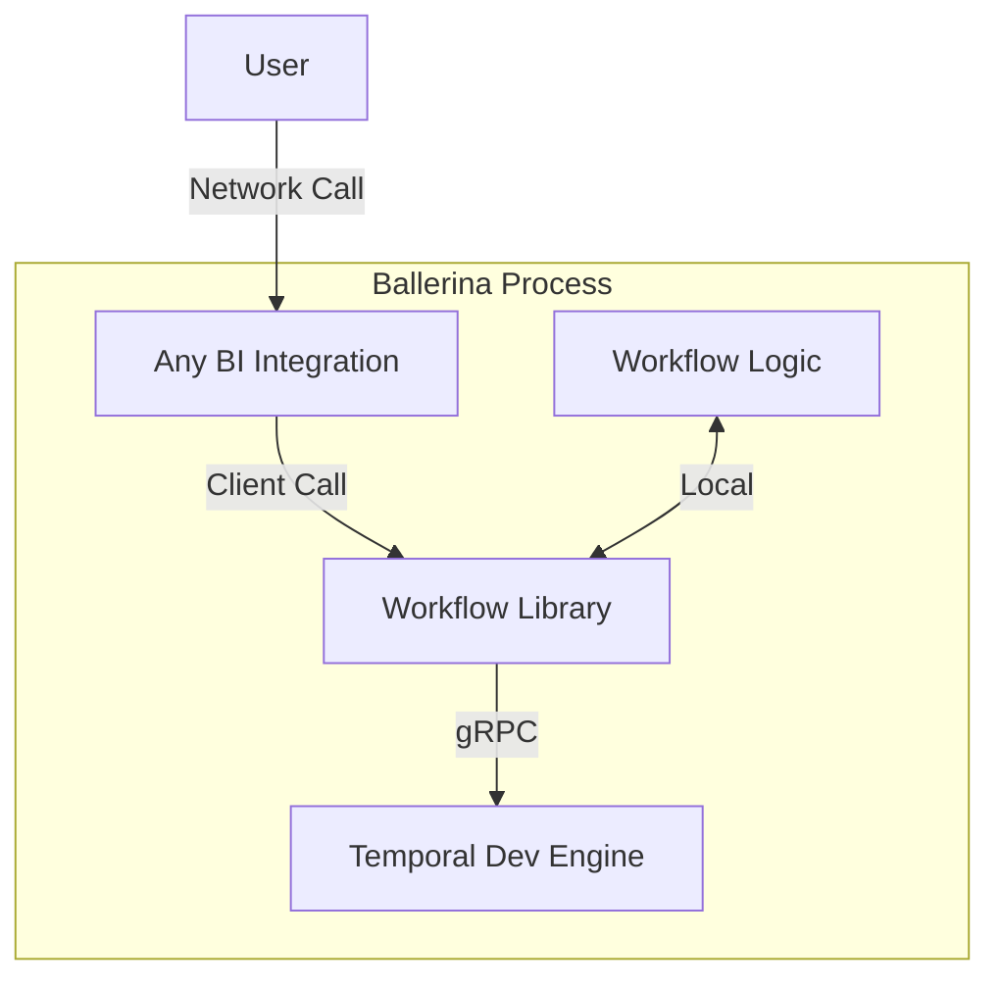
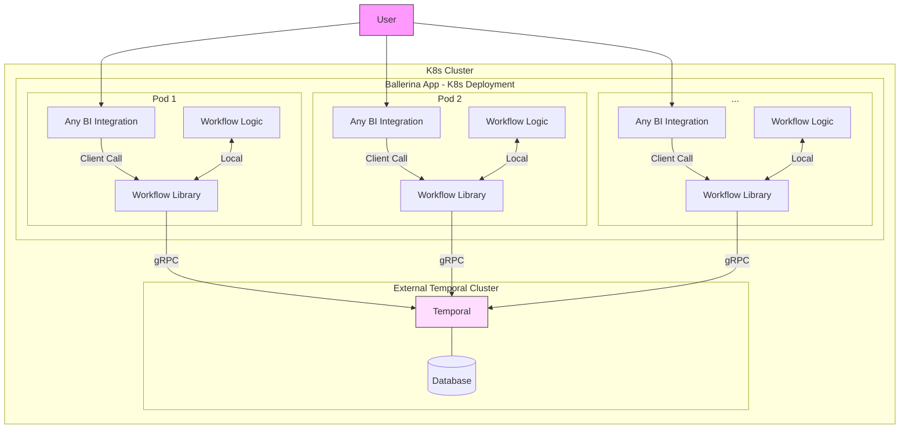
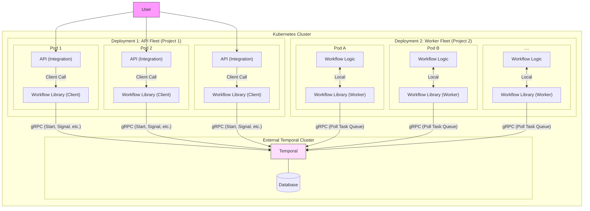

# Deployment Modes

There are several deployment models for running Ballerina applications that use the Temporal workflow engine.

Code must be organized so that there is a clear separation between the API layer (Integration) and the Worker layer (Workflow Logic), as they have different scaling and fault-tolerance requirements.

-----

## 1. Demo Mode: All-in-One with Embedded Engine

This mode is for development and demonstration only. The entire integration contains the API, Workflow Logic, and Temporal Dev Engine all in one process.

  * **Description:**
      * If using K8s, a single K8s Pod runs one container from the Ballerina integration.
      * An external database (like H2 or an external Postgres) might be used for persistence, but the engine itself is not clustered.
  * **Pros:** Simple, zero-dependency setup for local testing.
  * **Cons:** Not scalable, no fault-tolerance, not for production.

<!-- end list -->

-----

## 2\. Co-located Model: Standard Cluster

The Integration logic (API) and Workflow logic (Worker) are co-located in the same process, but they connect to a central, external engine.

  * **Description:**
      * A central, **external Temporal Cluster** is deployed once (e.g., in K8s).
      * The Ballerina Docker image is deployed as a K8s Deployment with **multiple replicas**.
      * **Each pod** runs both the Integration and the Workflow logic.
      * The Workflow Library connects to the external Temporal Cluster via gRPC.
  * **Pros:** Simpler to deploy than the decoupled model (one K8s deployment for the integration app).
  * **Cons:** Scaling is coupled (API and Workers scale together). A crash in the API code will also crash the Worker in that pod.

<!-- end list -->

## 3. Decoupled Model

For this deployment, the API layer and the Worker layer are fully decoupled at the source level, resulting in two separate integrations (e.g., two Ballerina projects) that are deployed independently.

The goal is to physically separate the API fleet from the Worker fleet.

  * **Description:**
      * A central, **external Temporal Cluster** is deployed once.
      * **Deployment 1 (API Fleet):** Runs the **API Integration** image. This deployment only starts the integration logic (API). Its `Workflow Library` (Client) makes gRPC calls to the Temporal Cluster.
      * **Deployment 2 (Worker Fleet):** Runs the separate **Workflow Integration** image. This deployment only starts the **Workflow Logic** and **Workflow Library** (Worker). Its `Workflow Library` makes gRPC calls to the Temporal Cluster to poll for tasks.
  * **Pros:** Independent scaling (scale APIs on traffic, scale Workers on load). Fault isolation (API can crash without stopping Workers, and vice-versa).
  * **Cons:** More complex project/source configuration (requires managing two separate Ballerina projects and Docker builds).

<!-- end list -->

